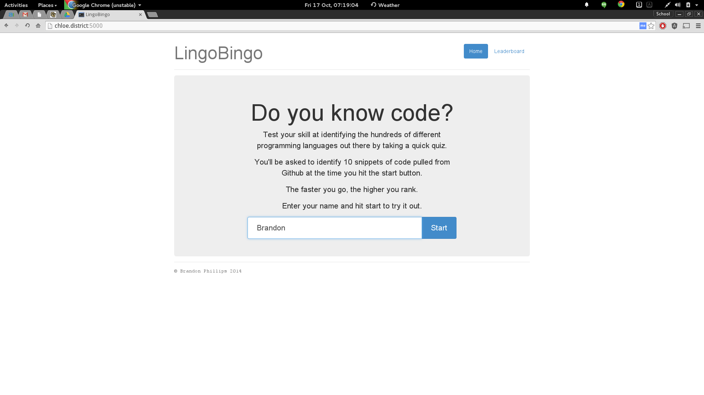
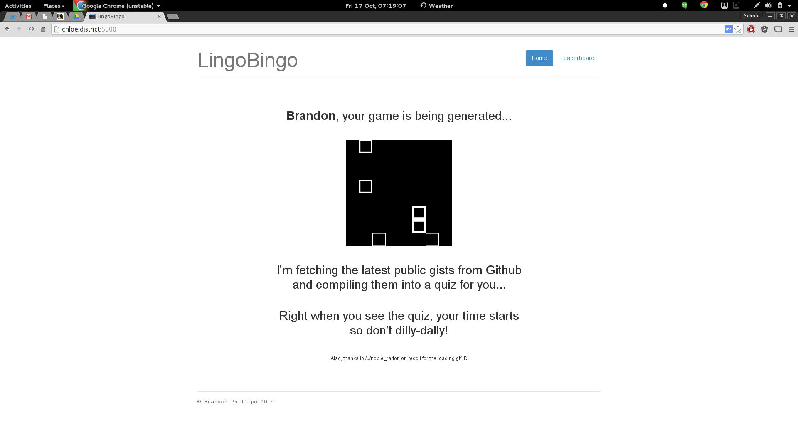
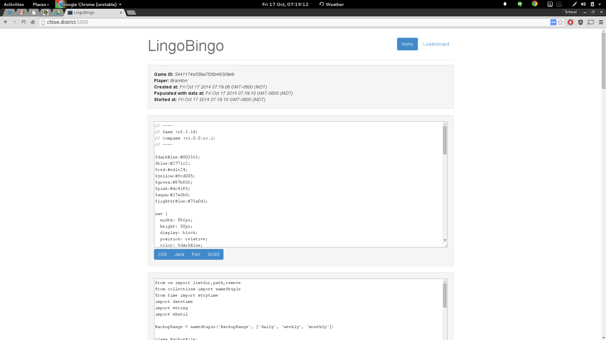
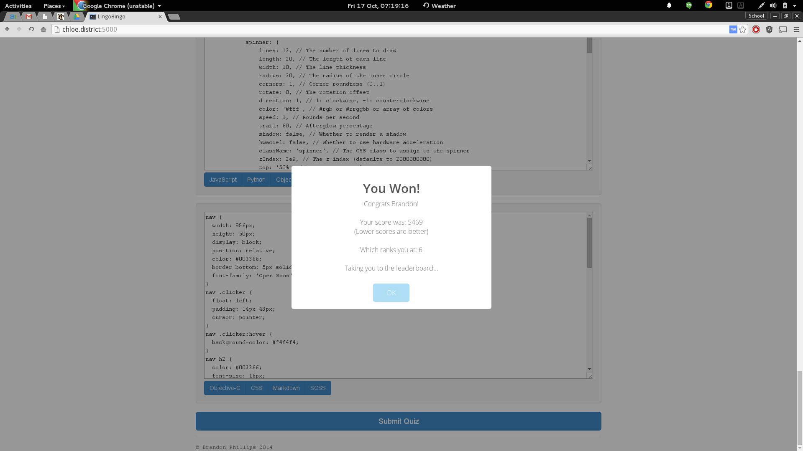
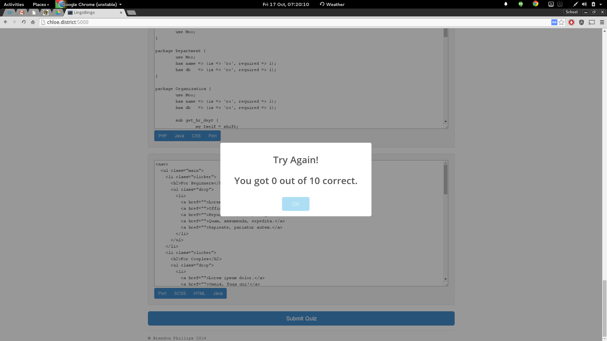
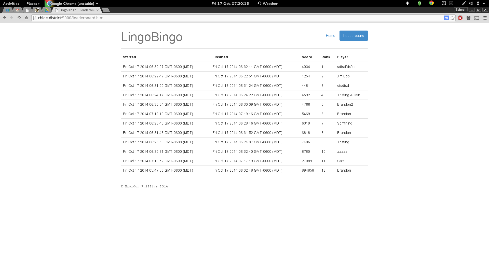

# What's required to play LingoBingo

Essentially:

 - MongoDB server
 - Python3
 - The following modules for python
   - Flask
   - MongoEngine
   - Requests
   
The first two need to be installed by your system's package manager but the python dependencies are installed locally
in the venv folder. If you already have the first to deps installed, you can run the server by doing the following:

    $ cd /dir/where/you/extracted/me
    $ . ./venv/bin/activate
    $ ./venv/bin/python lingobingo.py

# Play Lingo Bingo w/o Installing Anything

LingoBingo is running pre-built on heroku too. You can find it [here](http://lingo-bingo.herokuapp.com/). It's **highly**
suggested you play it this way since you'll be able to see a running leaderboard there of other people beside yourself.

# Structure

All static files for the very minimal front end are found in the `static` directory. Screenshots can be found in the
`screenshots` directory.

# Screenshots

